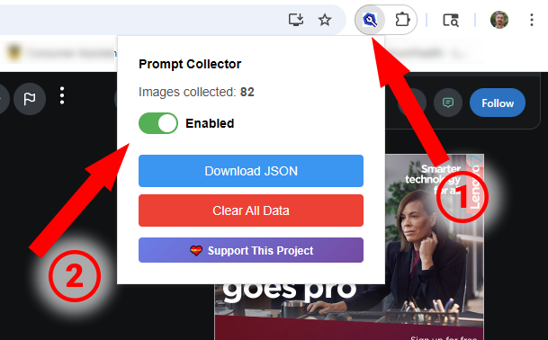
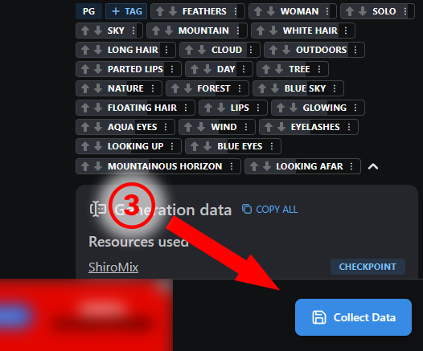

# Civitai Tag Collector

> **Tired of seeing the same type of content on Civitai over and over?**

If you've ever felt overwhelmed by endless "waifu" content, furry art, or any other genre dominating your feed on [Civitai.com](https://civitai.com) — you're not alone. The problem isn't Civitai; it's that popular content types naturally rise to the top, making it harder to discover the diversity of AI art the platform offers.

**This extension helps you fight content fatigue** by collecting actual tag data from images you encounter, analyzing patterns, and building surgical content filters that don't throw the baby out with the bathwater.

## The Problem: Content Fatigue

🔄 **You keep seeing the same genre** dominating your feed
❌ **Broad filters** like "anime" or "woman" remove too much good content
🤔 **You don't know what tags** to filter to get results you want
📊 **No data** to make informed filtering decisions

## The Solution

✨ **Data-driven filtering** - Collect real tag data from images you want to filter
🎯 **Surgical precision** - Find tags specific to unwanted content, not broad categories
📈 **Pattern analysis** - Export to JSON and analyze what tags appear most frequently
⚡ **Quick results** - Build effective filters in 10-15 minutes of collecting

## Features

- 🎯 **One-Click Collection**: Floating "Collect Data" button on Civitai image pages
- 🏷️ **Auto-Tag Extraction**: Captures Civitai's reliable auto-tagged categories
- 🎨 **Resource Tracking**: Collects models, LoRAs, and their versions
- 💾 **JSON Export**: Download collected data with timestamp for analysis
- 🔄 **Duplicate Prevention**: Automatically updates existing entries by image ID
- 🎚️ **Toggle Control**: Enable/disable collection on the fly
- 🗑️ **Clear Data**: Remove all collected data when finished
- 📊 **Real-time Counter**: See how many images you've collected



_Simple interface: toggle collection, download data, or clear it_

<br><br>



_The "Collect Data" button appears on every Civitai image page_

## Real Results

After analyzing 82 "waifu" images, we found that filtering just **2 tags** (`sexy attire` + `cleavage`) eliminates ~40% of unwanted content with minimal collateral damage. That's the power of data-driven filtering.

> **🚀 Quick Start:** Download this repo → Load unpacked in Chrome → Visit any Civitai image page → Click the blue "Collect Data" button

## Installation

### Step 1: Download the Extension

Choose one of these methods:

**Option A: Download ZIP (Easiest)**

1. Click the green **Code** button at the top of this page
2. Select **Download ZIP**
3. Extract the ZIP file to a permanent location on your computer
   - ⚠️ **Important**: Don't delete this folder! The extension loads from here.
   - Good locations: `Documents/Extensions/`, `Program Files/`, etc.
   - Bad locations: Downloads folder, Desktop (easy to accidentally delete)

**Option B: Git Clone (For developers)**

```bash
git clone https://github.com/LaughterOnWater/civitai-tag-collector.git
cd civitai-tag-collector
```

### Step 2: Install in Your Browser

#### Chrome

1. Open Chrome and navigate to `chrome://extensions/`
2. Enable **Developer mode** (toggle switch in the top-right corner)
3. Click **Load unpacked** button (top-left)
4. Navigate to and select the `civitai-tag-collector` folder (the folder containing `manifest.json`)
5. The extension should now appear in your extensions list
6. Look for the extension icon in your toolbar (you may need to click the puzzle piece icon to pin it)

#### Edge

1. Open Edge and navigate to `edge://extensions/`
2. Enable **Developer mode** (toggle switch in the left sidebar)
3. Click **Load unpacked** button
4. Navigate to and select the `civitai-tag-collector` folder
5. The extension should now appear in your extensions list

### Step 3: Verify Installation

1. Navigate to any Civitai image page (e.g., `https://civitai.com/images/12345678`)
2. You should see a blue **"Collect Data"** button in the bottom-right corner
3. Click the extension icon in your toolbar to open the popup

### Troubleshooting Installation

**"Developer mode extensions" warning banner**

- This is normal for unpacked extensions and can be safely ignored
- The extension is open-source - you can inspect all the code in this repository

**Button not appearing on Civitai**

- Make sure you're on an image detail page (`/images/*`), not the gallery or browse pages
- Refresh the page after installing the extension
- Check that the extension is enabled in `chrome://extensions/`

**Extension disappeared after restart**

- The folder was deleted or moved - reinstall from a permanent location
- Developer mode was disabled - re-enable it

## Usage

### Collecting Data

1. Navigate to any Civitai image detail page (e.g., `https://civitai.com/images/12345678`)
2. Look for the blue **"Collect Data"** button in the bottom-right corner
3. Click the button to collect data from the current image
4. The button will turn green briefly to confirm collection
5. If you've already collected this image, you'll see a notification (data gets updated)

> 💡 **Tip:** The extension only works on individual image pages (`/images/123`), not on gallery or browse pages.

### Managing Your Data

1. Click the extension icon in your toolbar to open the popup
2. View the **count** of collected images
3. Use the **toggle switch** to enable/disable collection
4. Click **Download JSON** to export your data with a timestamp
5. Click **Clear All Data** to remove all collected entries (with confirmation)

### Analyzing Your Data

After collecting data, open the JSON file to analyze patterns:

```json
[
  {
    "imageId": "12345678",
    "url": "https://civitai.com/images/12345678",
    "resourcesUsed": [
      {
        "name": "WAI-illustrious-SDXL",
        "type": "Checkpoint",
        "version": "v14.0"
      }
    ],
    "tags": ["anime", "character", "solo", "looking at viewer"],
    "collectedAt": "2025-11-02T21:30:00.000Z"
  }
]
```

## Building Effective Filters

Based on analysis of collected data, here are surgical filtering strategies for common content types:

### Filtering "Waifu" Content

Start with high-precision tags that specifically target sexualized anime characters:

**Tier 1: High Precision**

- `sexy attire`
- `cleavage`

**Tier 2: Medium Precision** (add if needed)

- `large breasts`
- `huge breasts`

**Tier 3: Lower Precision** (more aggressive)

- `blush`
- `looking at viewer`

### Other Common Filters

**Furry/Anthro Content:**

- `furry`, `anthro`, `pony`, `furry female`

**Mature Content:**

- `hentai`, `futa`

**Disturbing Content:**

- `gore`, `body horror`

### Tag Analysis Tips

Use Python or a JSON viewer to analyze your collected data:

```python
import json
from collections import Counter

with open('your_data.json', 'r') as f:
    data = json.load(f)

# Count all tags
all_tags = []
for item in data:
    all_tags.extend(item['tags'])

tag_counts = Counter(all_tags)
print(tag_counts.most_common(20))
```

## Data Structure

Each collected entry contains:

| Field           | Type   | Description                               |
| --------------- | ------ | ----------------------------------------- |
| `imageId`       | string | Civitai image ID extracted from URL       |
| `url`           | string | Full URL to the image page                |
| `resourcesUsed` | array  | Models/LoRAs with name, type, and version |
| `tags`          | array  | Civitai auto-tagged categories            |
| `collectedAt`   | string | ISO timestamp of collection               |

## Privacy & Storage

- All data is stored **locally** in your browser using `chrome.storage.local`
- No data is sent to external servers
- Data persists until you clear it using the "Clear All Data" button
- JSON exports are saved to your Downloads folder

## Getting Updates

Since this extension is loaded from source, updates aren't automatic. To get new features and bug fixes:

1. **Watch this repository** (click "Watch" at the top) to get notified of updates
2. When a new version is released:
   - Download the latest code (or `git pull` if you cloned)
   - Go to `chrome://extensions/`
   - Click the **refresh icon** on the Civitai Tag Collector card
3. Refresh any open Civitai pages to load the new version

Your collected data is preserved during updates (stored in browser storage, not in the extension folder).

## Troubleshooting

### Button Not Appearing

- Make sure you're on a Civitai image detail page (`/images/*`)
- Refresh the page after installing/updating the extension
- Check that the extension is enabled in your browser's extension settings

### No Tags Collected

- Some images may not have auto-tags applied
- The "Generation Data" section must be visible on the page
- Check the browser console (F12) for detailed extraction logs

### Extension Not Working After Civitai Update

Civitai may change their HTML structure. If extraction stops working:

1. Open an issue on GitHub with the image URL
2. Check console logs for extraction errors
3. The extension may need updates to match new HTML selectors

## Development

### File Structure

```
civitai_prompt_collector/
├── manifest.json       # Extension configuration
├── background.js       # Service worker for data persistence
├── content.js          # Main extraction and UI logic
├── popup.html          # Extension popup UI
├── popup.js            # Popup functionality
├── CLAUDE.md          # Development documentation
└── icon*.png          # Extension icons
```

### Key Technologies

- **Manifest V3**: Modern Chrome extension API
- **Chrome Storage API**: Local data persistence
- **MutationObserver**: Handles Civitai's single-page app navigation
- **Mantine UI Detection**: Extracts data from Civitai's React components

## Contributing

Contributions are welcome! Please:

1. Fork the repository
2. Create a feature branch
3. Make your changes with clear commit messages
4. Test thoroughly on Civitai.com
5. Submit a pull request

### Reporting Issues

When reporting bugs, please include:

- Browser and version
- Extension version
- Civitai image URL where the issue occurs
- Console logs (F12 → Console tab)
- Screenshots if applicable

## License

This project is licensed under the MIT License - see the [LICENSE](LICENSE) file for details.

## Disclaimer

This extension is not affiliated with Civitai. It's a community tool for personal content curation and analysis. Use responsibly and in accordance with Civitai's Terms of Service.

## Acknowledgments

Built to help users curate their Civitai experience and combat content fatigue. Special thanks to the community for feedback on effective filtering strategies.

---

**Found this helpful?** Star the repo and share with others struggling with content overload!
